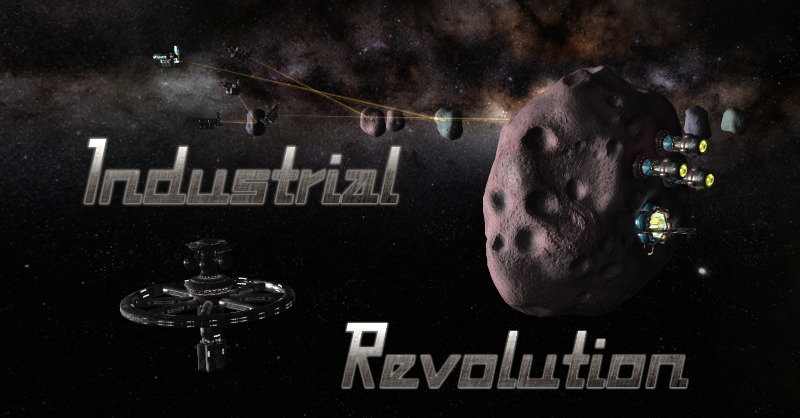

# Industrial Revolution
_A mod for Star Ruler 2_

This mod makes civilian transport ships more important.
(... and more industrial / eco stuff planned)

- Resource connections rely directly on arriving trade ships.
  When trade ships are destroyed the connection they represent will be disabled until the next ship actually arrives.

- No more random Civilian Traders in your neighbouring systems, wasting precious cargo space for sight seeing tours

# done
- more asteroids (more shards, resource asteroids got companions too. needs tuning)
- changed civilian trade ship navigation
    - asteroids with mining bases spawn trade ships (which can be destroyed, thus blockaded)
    - added "Blockaded Export" status, the specific resource is blockaded if ships are shot down until new ones arrive
      old "Blockaded" status still applies to the target planet, if the ship was carrying goods from a trade station (currently disabled)
    - trade ships don't reassign to random planets after delivering inter-system resources anymore.
- moved trade stations to be at 'exit points' of systems, repurposed back to trading
- every planet has a "Customs Office" now, will not spawn ships until CO is present
- civilians (from a foreign empire) are enemies too for AI (colony ships apparently too, need tuning)
- added Statuses to Asteroids
- multiple ships per route (1/min/route)
- almost complete restructure of civilian navigation
- removes blockaded status when a planet/asteroid changes export target.
  (in case its still under siege it will regain status quickly)

# todo (ideas)
- add upgrades to customs offices (through planet buildings or orbitals)
      currently they start MAX size, they could start min and be upgraded in steps
- rework pirates (smaller, more of them, camping on lanes, interceptable, more stashes, occasional raid)
- change ore asteroids to use a mining bases like a resource
    - with shards there would be one main roid per group where a mining base has to be built to start operations (maybe w/ fake ships).
    - like a resource, as soon as you connect it it's available, with a random yield ore/min on the receiving planet (or global)
    - maybe add upgrades (planet buildings or orbitals)
- ask Dalo about global ore trickery (maybe can port from RS)
    - add more ore requirements to buildings (easier to get ore)
- change AI to care for all this (prob no pirates for them or fake ones)
- add inter-trade-station traffic as tech (for more income, maybe inter-empire as treaty, check treaty code functionality)